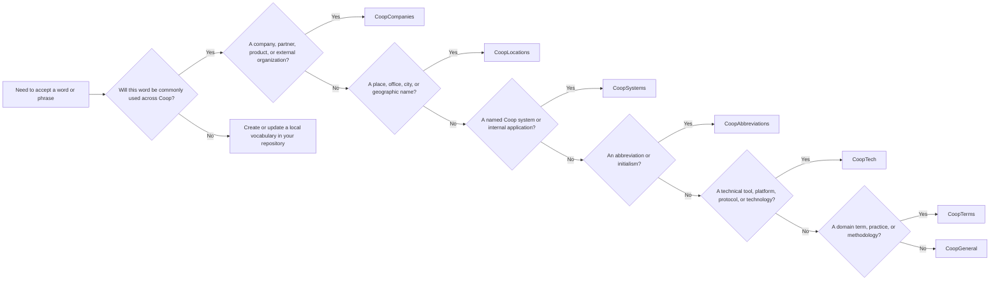

# Writing vocabulary entries

[Vale vocabularies](https://docs.vale.sh/keys/vocabularies) are lists of regular
expressions. An entry in an `accept.txt` file tells Vale that matching text is
an accepted spelling. Write one entry that covers the intended variants instead
of adding one entry for every capitalization or grammatical form.

## One entry per word

Before adding an entry, search all of the vocabularies for the word and its
common variants. Check both `accept.txt` and `reject.txt` files. If the word
already has an entry, extend or move that entry instead of creating a duplicate.

For example, these four entries describe the same word and should not be added
separately:

```text
Fish
fish
fishes
Fishes
```

Use one regular expression when both capitalization and the plural form are
accepted:

```text
[Ff]ish(?:es)?
```

This matches `Fish`, `fish`, `Fishes`, and `fishes`. The parts of the expression
are:

- `[Ff]` accepts either initial capitalization.
- `ish` is the invariant part of the word.
- `(?:es)?` makes the `es` ending optional without creating a capturing group.

Do not generalize variants that are not actually valid. For example, do not add
an optional plural suffix just because a word is usually a noun. Preserve
meaningful spelling differences and use alternatives when the accepted forms
cannot be described by one safe pattern:

```text
(VSCode|vscode)
```

Use the narrowest expression that covers the intended forms. A broad pattern can
accept unrelated words and hide spelling errors.

## Choosing a vocabulary

Use the following flowchart before adding an entry. Start by considering whether
the word is useful across Coop, rather than assuming that every accepted word
belongs in the shared package.



The package currently contains these vocabularies:

| Vocabulary          | Use for                                                           | Examples                                |
| ------------------- | ----------------------------------------------------------------- | --------------------------------------- |
| `CoopCompanies`     | Companies, partners, products, and external organizations         | `GitHub`, `Datadog`, `MuleSoft`         |
| `CoopLocations`     | Places and geographic names                                       | `Grorud`, `Universitetsgata`            |
| `CoopSystems`       | Named Coop systems and internal applications                      | `MemberCache`, `Coopay`, `ShoppingList` |
| `CoopAbbreviations` | Abbreviations and initialisms                                     | `API`, `GDPR`, `UUID`                   |
| `CoopTech`          | Tools, platforms, protocols, and technologies                     | `Kubernetes`, `GraphQL`, `OpenAPI`      |
| `CoopTerms`         | Domain terms, practices, and methodologies                        | `DevOps`, `Kanban`, `Wi-Fi`             |
| `CoopGeneral`       | General accepted words that do not fit another package vocabulary | `backend`, `observability`, `roadmap`   |

If a word could fit more than one vocabulary, choose the most specific one. For
example, `Kubernetes` is a technology, so it belongs in `CoopTech`, while a
repository's own service name belongs in a local vocabulary even if it sounds
technical. When the word is specific to a single repository, do not add it to
this shared package.

## Local vocabularies

Use a local vocabulary when a word is not likely to be commonly used across
Coop, is temporary, or is owned by a team that does not maintain this package.
This keeps the shared package focused and prevents repository-specific names
from becoming global spelling rules.

Create the vocabulary under your repository's Vale styles path. For example:

```text
.vale/
├── styles/
│   └── Vocab/
│       └── MyRepository/
│           └── accept.txt
└── .vale.ini
```

Add the vocabulary name to `.vale.ini`:

```ini
StylesPath = .vale/styles

Packages = https://github.com/coopnorge/vale-coop/releases/latest/download/Coop.zip

Vocab = MyRepository
```

Then put one canonical regex per line in
`.vale/styles/Vocab/MyRepository/accept.txt`, for example:

```text
[Ff]ish(?:es)?
```

For the shared Coop package, entries go in the matching `accept.txt` under
`Coop/styles/config/vocabularies/<VocabularyName>/`. Add a `reject.txt` entry
only when a spelling must be explicitly rejected and the rule is intentionally
part of that vocabulary.

## Before opening a change

Check the following:

1. Search for the word, its case variants, plurals, and common inflections
   across all vocabularies.
2. Remove or consolidate duplicate entries rather than adding another spelling
   line.
3. Use a regex that matches only the accepted forms.
4. Confirm the word belongs in the selected shared vocabulary, or keep it local
   to the repository.
5. Run Vale or the repository's documentation validation against examples that
   cover every intended form.
